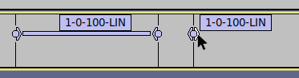

# GLYPH TOOLS

<p align="center">
This repo is intended to be a collection of tools and scripts to make it easy to create custom Nothing Glyph Compositions which in turn can be imported into the <i>Nothing Glyph Composer</i>.
</p>

https://github.com/SebiAi/custom-nothing-glyph-tools/assets/41116921/1852f2a6-1cf9-4c0e-9835-792bf1b09a58


## Regarding the update (1.3.0)
> It seems like the latest update of the Nothing Glyph Composer with the Swedish House Mafia pack enabled Nothing Phone 2 exclusive compositions which seem to use all of the available Glyphs on the Phone 2. I am looking into that right now.

***

# :pushpin: Disclaimer
> These scripts are provided as-is without any warranty. I and all other contributors are not responsible for any damage, misuse or other kind of physical or mental damage which results in the use of these scripts.
This repo is in no way shape or form affiliated with Nothing Technology Limited (NOTHING).

***

# :safety_vest: Need help?
If you need help look at the [Troubleshooting](#interrobang-troubleshooting) chapter. If this does not help either feel free to reach out to me on Discord: @sebiai

***

# :construction: Compatibility
## OS
* Linux :white_check_mark:
* Windows :white_check_mark:
* Mac :question: - \[*To be tested - please reach out to me if you manage to get it working!*\]

I have only tested the scripts on Linux. Somebody else managed to do it on Windows. There *should* be nothing preventing them to run on MacOS.
## Phones
* Nothing Phone 1 :white_check_mark:
* Nothing Phone 2 :white_check_mark:

Works on both Nothing devices.

***

# :pencil2: Usage
## :memo: Requirements
* \[*Required*\] [**python3**](https://www.python.org/downloads/) - To run the scripts
* \[*Required*\] [**ffmpeg**](https://ffmpeg.org/download.html) - To write metadata to the sound file
* \[*Required*\] [**ffprobe**](https://ffmpeg.org/download.html) - To read metadata from the sound file (should be included in almost every ffmpeg install)
* \[*Optional*\] [**Audacity&reg;**](https://www.audacityteam.org/) - Create custom compositions more easily with Labels

    :arrow_right: If *ffmpeg* or *ffprobe* are not in PATH they can be passed to the script with the `--ffmpeg` and `--ffprobe` arguments.

## :rocket: Setup
#### Clone the repo
```bash
git clone https://github.com/SebiAi/custom-nothing-glyph-tools.git
cd custom-nothing-glyph-tools
```
If you don't feel comfortable using git then you can also [download an archive file here](https://github.com/SebiAi/custom-nothing-glyph-tools/archive/refs/heads/main.zip).

#### Install the necessary python dependencies
```bash
pip3 install -r requirements.txt
```
Sometimes it is also just `pip` instead of `pip3`.

## :sparkles: Making a custom Glyph composition
I would recommend using [Audacity&reg;](https://www.audacityteam.org/) to make your life easier. You can use it to cut your audio to the right length, layer effects on it, set Labels (which will come in handy later) and more.

### Cutting the sound
You can skip to [Creating the Glyph format with Audacity&reg;](#creating-the-glyph-format-with-audacity) if you already have the sound cut to the right length.

When exporting the sound always use the *opus* codec:
1) **Export audio:** Files -> Export -> Export Audio...
2) **Select the right codec in the dropdown:** Select Opus - default settings are fine
3) **Change the extension to *ogg* when naming your file!**
4) **Export**

### Creating the Glyph format with Audacity&reg;
To make our lives easier we can utilize Audacity&reg;'s Labels functionality and then use the Label data to generate our two needed csv files with the help of the [GlyphTranslator](./GlyphTranslator.py) - one for the *AUTHOR* tag (stores the light data) and the other for the *CUSTOM1* (stores data for the app to display) tag (for more info read the [technical details](#wrench-the-technical-details)).

I would recommend saving your Audacity&reg; project regularly.

#### Add the Labels track
1) **Open your audio with Audacity&reg;**
2) **Add the Labels track:** Tracks -> Add New -> Label Track

#### Creating and removing Labels
You can now add Labels by clicking on your desired location on the Label Track and pressing <kbd>CONTROL</kbd> + <kbd>b</kbd>. To remove one Label right-click on the Labels name and choose *Delete Label*. More info [here](https://manual.audacityteam.org/man/removing_labels_examples.html).

#### Naming format
Each Label should be named like this: `glyphId-lightLevelFrom[-lightLevelTo[-Mode]]`
* **glyphId**: 1 to 5 (Camera, Diagonal, Battery/Wireless Charger, USB Line, USB Dot)
* **lightLevelFrom** and **lightLevelTo**: In percent 0 to 100. When no *lightLevelTo* is provided *lightLevelFrom* will be used as the from and to value.
* **Mode**: Currently there are three modes supported ([Desmos Graphs](https://www.desmos.com/calculator/92ajzgfbat)):
    * LIN: Linear Interpolation (default)
    * EXP: Exponential Interpolation
    * LOG: Logarithmic Interpolation

The brackets (`[` and `]`) mean optional. Therefore do **NOT** include them in the Label name!

If you like regex patterns, the name of the Label should match this one (thanks [Joel05](https://github.com/SebiAi/custom-nothing-glyph-tools/issues/1)):
```regex
^([1-5])-(\d{1,2}|100)(?:-(\d{1,2}|100))?(?:-(EXP|LIN|LOG))?$
```

> **:warning: Important**

**At the end of the audio there MUST be a Label called *END*.** This is needed so the script knows how long the audio is. Also, make sure that there is enough space between your last Glyph lighting up and the *END* Label or else it might not get played - add silence at the end of the audio file if that happens and move the *END* Label accordingly.

Example 1:
```
0.031441	0.031441	2-0-100-LIN
0.074091	0.074091	2-100-0-LIN
0.198122	0.198122	3-0-100-LIN
0.242847	0.242847	3-100-0-LIN
0.296312	0.296312	END
```
In this example, the Mode `-LIN` is not necessary because it is the default but makes it more readable.

Example 2:
```
0.031441	0.031441	2-0-100
0.074091	0.074091	2-100-0
0.198122	0.198122	3-0-100
0.242847	0.242847	3-100-0
0.296312	0.296312	END
```
This is a minimalized version of *Example 1*.

Example 3:
```
0.031441	0.031441	2-100
0.074091	0.074091	3-100-0
0.198122	0.198122	4-0-100-EXP
0.296312	0.296312	END
```
Another example with one exponential interpolation (`-EXP`) and line one and two are minimalized. They expand to `2-100-100-LIN` and `3-100-0-LIN`.

#### Exporting Labels
1) **File -> Export -> Export Labels**

#### Converting Labels to Glyph format
Now that we have a Labels file we can use the [GlyphTranslator](./GlyphTranslator.py) to get our desired files like this:
```bash
python3 GlyphTranslator.py MyLabelFile.txt
```
Assuming your Label file was called `MyLabelFile.txt` it will spit out two files called `MyLabelFile.glypha` and `MyLabelFile.glyphc1` in your current working directory.

### Read and write the Glyph format data to an audio file
#### Read from an audio file
```bash
python3 GlyphModder.py MyGlyphCreation.ogg
```
Assuming your audio file was called `MyGlyphCreation.ogg` it will spit out two files called `MyGlyphCreation.glypha` and `MyGlyphCreation.glyphc1` in your current working directory.

You can provide the path to *ffprobe* with the `--ffprobe` argument if it can not be found in PATH.

#### Write to an audio file
When you have both your `.glypha` and `.glyphc1` files (via Audacity&reg; and the GlyphTranslator method or otherwise) you can write them to an audio file as metadata:
```bash
python3 GlyphModder.py -t MyCustomTitle -w MyLabelFile.glypha MyLabelFile.glyphc1 MyGlyphCreation.ogg
```
The `-t` argument is optional, this just sets the *TITLE* tag which, as far as I could see, is not used anywhere in the Glyph Composer right now.

You can provide the path to *ffmpeg* with the `--ffmpeg` argument if it can not be found in PATH.

> **:warning: Important**

**Regarding the `-w` option: The `.glypha` file must be passed before the `.glyphc1` file. The script will still comply but you can not play the file in the Glyph Composer!**

Congrats, you can now transfer the audio file to your Nothing phone and import it into the Glyph Composer app!

***

# Hardware limitations
* On the Phone (1) at least the Glyphs can't playback fast-changing light sequences. One user reported that this phenomenon disappeared when it was set as a ringtone or notification sound.

***

# :interrobang: Troubleshooting
## I can't find the modified audio file after using GlyphModder
The file was modified in place, no other files were generated.

If you want to confirm that the metadata was written correctly see [here](#glyph-composer-does-not-import-my-file).

## Glyph Composer does not import my file
Make sure that the file has the right codec and that the metadata is present:
```bash
ffprobe MyGlyphCreation.ogg
```
It should spit out something like this:
```
Input #0, ogg, from 'MyGlyphCreation.ogg':
  Duration: 00:00:10.01, start: 0.000000, bitrate: 146 kb/s
  Stream #0:0: Audio: opus, 48000 Hz, stereo, fltp
    Metadata:
      encoder         : Lavf58.76.100
      TITLE           : MyCustomSong
      ALBUM           : CUSTOM
      AUTHOR          : eNrtxqENAAAIAzBPwieI/X8dhg+wTU0zOV1xd3d3d3d3d3d3d3d3d/f3F8ocpN8=
      COMPOSER        : Spacewar Glyph Composer
      CUSTOM1         : eNoljVsKAEEIwy60A+r4qPe/2E7pj8FAiZ340vvYh8S7HjBiPB7ivUQ1ZexS3owkUJxlDGWOUZZf
                      : yqrmrs24awVahVFhVIAKUAEqrAqrwg8LSR98
```
Important are:
* Audio: **opus**
* The extension `.ogg`
* The presence of the metadata tags TITLE, ALBUM, AUTHOR, COMPOSITOR and CUSTOM1 (the order is irrelevant)

### Wrong codec
You have two options:
* Reexport with Audacity&reg; (see [here](#cutting-the-sound))
* Convert with ffmpeg (replace `MyGlyphCreation.ogg` with your audio): `ffmpeg -i MyGlyphCreation.ogg -strict -2 -c:a opus -map_metadata 0:s:a:0 output.ogg`

### Wrong extension
See [Wrong codec](#wrong-codec)

### No or missing metadata
Did you run the [GlyphModder](./GlyphModder.py) correctly? See [here](#write-to-an-audio-file).

# No glyphs light up
See [Glyph Composer does not import my file](#glyph-composer-does-not-import-my-file).

## I can import my audio but my glyphs don't light up
When you use the linear, exponential or logarithmic mode make sure that your Labels cover a range like this left Label:


You can make the right Label ranged if you drag on the left or right part of it.

## Some of my glyphs don't light up
See [I can import my audio but my glyphs don't light up](#i-can-import-my-audio-but-my-glyphs-dont-light-up).

***

# :wrench: The technical details
<details>
  <summary>Click to expand</summary>

  **This is just a written up more technical view on this whole system.**

  ## Audio
  The audio seems disconnected from the lighting - seems like it only determines the final length of the composition. The maximum you can produce in the app is 10s but it can be longer when making it custom.
  
  ## Metadata
  There are the following tags in the ogg file (order irrelevant):
  * TITLE
  * ALBUM
  * AUTHOR
  * COMPOSER
  * CUSTOM1
  * CUSTOM2
  
  The *AUTHOR* and *CUSTOM1* tags contain both *Base64* encoded and then *zlib compressed* data (Best Compression (no preset dictionary) - see [here](https://en.wikipedia.org/wiki/List_of_file_signatures)).
  
  ### TITLE
  Contains the title given in the Glyph composer. Weirdly enough the Glyph Composer does not use this tag when displaying the name of the composition - the filename is used instead.
  
  ### ALBUM
  Saves what sound pack was used when the composition was created. Can be changed without any effect on the audio or lights (could affect the preview in the *Glyph Composer*). It does display in the *Glyph Composer*.
  
  ### AUTHOR
  After decoding and decompressing it contains the Glyph light data in a csv like manner where in each line we have the *5 Glyphs*/*33 Zones* separated and followed by a comma (`,`). Each line corresponds to 16ms.
  
  Depending on if the [*CUSTOM2*](#custom2) tag is set to `33cols` we have, what I will call, the *5 Glyphs* or *33 Zones* mode:
  * Not set => *5 Glyphs* mode - 5 columns
  * Set => *33 Zones* mode - 33 columms (**Nothing Phone (2) exclusive**)
  
  #### Indexes for the Glyphs
  Depending on the mode we have different indexes for the Glyphs:
  ##### *5 Glyphs* mode
  | Index | Glyph    |
  |:-----:|:---------|
  |   0   | Camera   |
  |   1   | Diagonal |
  |   2   | Battery  |
  |   3   | USB Line |
  |   4   | USB Dot  |

  ##### *33 Zones* mode
  | Index | Glyph                                | Direction          |
  |:-----:|:-------------------------------------|:-------------------|
  |   0   | Camera top                           | -                  |
  |   1   | Camera bottom                        | -                  |
  |   2   | Diagonal                             | -                  |
  |  3-18 | Battery top right                    | From right to left |
  |   19  | Battery top left                     | -                  |
  |   20  | Battery top vertical (left side)     | -                  |
  |   21  | Battery bottom left                  | -                  |
  |   22  | Battery bottom right                 | -                  |
  |   23  | Battery bottom vertical (right side) | -                  |
  |   24  | USB Dot                              | -                  |
  | 25-32 | USB Line                             | From bottom to top |

  Each Glyph can have a light value from 0 to 4080 and it appears that the smallest step is 1. If the data is longer than the audio it will not be played.

  The new line consists of Carriage Return (CR) and Line Feed (LF): `\r\n`
  The data ends with a final new line `\r\n`.

  Most of the data is padded at the end with multiple "zero lines" (`0,0,0,0,0,`) even if the audio track has ended - therefore also the playback of the light show.
  
  This might be because of how the light data is stored in the app itself which are csv files for every audio clip which are combined.

  *Example 5 Glyphs:*
  ```csv
  0,0,4080,0,0,
  0,0,4080,0,2032,
  0,0,0,0,0,
  0,0,0,0,0,
  0,0,0,0,0,

  ```
  The *Battery* Glyph is fully on for 32ms and the *USB Dot* Glyph is only on for 16ms after 16ms (after the start) at about 50% brightness.

  *Example 33 Zones:*
  ```csv
  0,0,0,2709,2709,2709,2709,2709,2709,2709,2709,2709,2709,2709,2709,2709,2709,2709,2709,0,0,2709,0,0,0,0,0,0,0,0,0,0,0,
  0,0,0,1791,1791,1791,1791,1791,1791,1791,1791,1791,1791,1791,1791,1791,1791,1791,1791,0,0,1791,0,0,0,0,0,0,0,0,0,0,0,
  0,0,0,919,919,919,919,919,919,919,919,919,919,919,919,919,919,919,919,0,0,919,0,0,0,0,0,0,0,0,0,0,0,
  0,0,0,245,245,245,245,245,245,245,245,245,245,245,245,245,245,245,245,0,0,245,0,0,0,0,0,0,0,0,0,0,0,

  ```
  
  ### COMPOSER
  This depends on what device the composition was created on:
  * Phone (1): `Spacewar Glyph Composer`
  * Phone (2): `Pong Glyph Composer`

  If this does not match the Glyph Composer will not import the file.

  It ***is*** totally possible to import a Phone (2) composition **IF** the *CUSTOM2* tag is **NOT** set, which infers that no *33 Zone* sound pack was used.
  
  ### CUSTOM1
  This is mainly data for the Glyph Composer so it can display the timeline when playing the file. After decoding and decompressing each dot in the app is defined by a timestamp (in ms and 1 ms steps) and a Glyph id (see [AUTHOR](#author)) separated by a dash (`-`). Between each dot is a comma (`,`) and at the end of the line also.
  
  There are no new lines in this file, all dots are after one another.
  It is entirely possible to mismatch the *CUSTOM1* and *ALBUM* data (could affect the preview in the *Glyph Composer*).

  ### CUSTOM2
  This indicates if the saved data in the *AUTHOR* tag uses the *33 Zone* addressing instead of the *5 Glyphs* addressing.

  This tag will only be present if the composition was made on a Nothing Phone (2) and with a *33 Zone* sound pack (e.g.: Swedish House Mafia) therefore this composition can only be played back on a Nothing Phone (2).

  It *can* be manually imported on a Nothing Phone (1) by moving the audio file to `Ringtones/Compositions` but it will interpret the lighting data in the *5 Glyphs* mode (see [*Author*](#author) tag).
</details>

***

# Pull requests
Pull requests are welcome (improvements, new scripts/tools).
